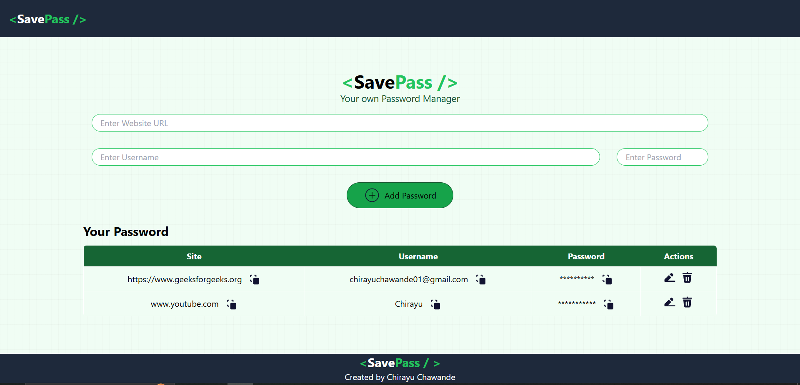

# SavePass - Your own Password Manager

**SavePass** is a **Password Manager Website** developed to manage user credentials. The frontend is built with **React** and **Tailwind CSS**, while the backend is powered by **Express.js** and **MongoDB**, deployed separately as an API. The site allows users to add, edit, and delete credentials stored in the MongoDB database.

## Features

1. **Credential Management**:
   - Add, edit, and delete credentials securely.
   - All data is stored in a **MongoDB** database via the backend API.
2. **Modern UI**:
   - Designed with **Tailwind CSS** for a clean and responsive layout.
   - Features **ibelick gradient backgrounds** for a visually appealing interface.
   - Includes **Lord Icons** for enhanced user experience.
3. **Seamless API Communication**:
   - The frontend communicates with the backend API for data management.
   - Fixed CORS issues to enable smooth interaction between frontend and backend.
4. **Deployment**:
   - The frontend is deployed on **Vercel** for fast and reliable performance.
   - The backend is deployed separately and serves as an API.

## Deployment

The SavePass Website frontend is live and can be accessed here: [SavePass Live Demo](https://save-pass-gold.vercel.app/)

## Getting Started

Follow these steps to run the project locally:

### Prerequisites

Ensure you have the following installed on your machine:
- **Node.js** and **npm** for managing dependencies.
- **MongoDB** for database storage.

### Installation

1. Clone the repository:
   ```bash
   git clone https://github.com/ChirayuC01/save-pass.git
   ```
2. Navigate to the project directory:
   ```bash
   cd save-pass
   ```
3. Install dependencies:
   ```bash
   npm install
   ```
4. Start the development server:
   ```bash
   npm run dev
   ```
5. To build the project for production:
   ```bash
   npm run build
   ```

## Technologies Used

- **React.js**: For building a dynamic and responsive user interface.
- **Express.js**: Backend framework for API creation and handling server-side logic.
- 
- **Tailwind CSS**: Utility-first CSS framework for styling.
- **Lord Icons**: Animated icons for an interactive user experience.
- **Vercel**: Deployment platform for fast and reliable hosting.
  
## Screenshots

